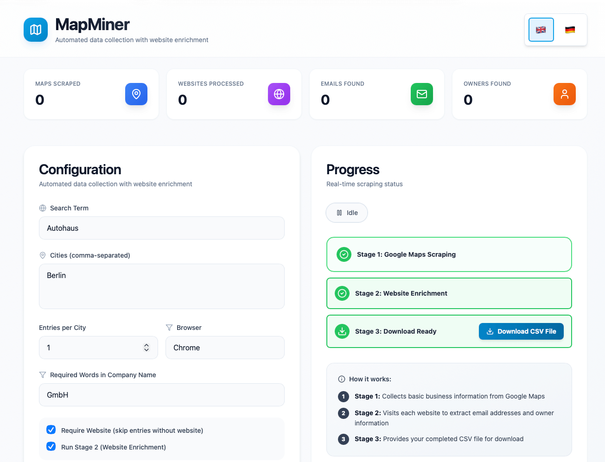
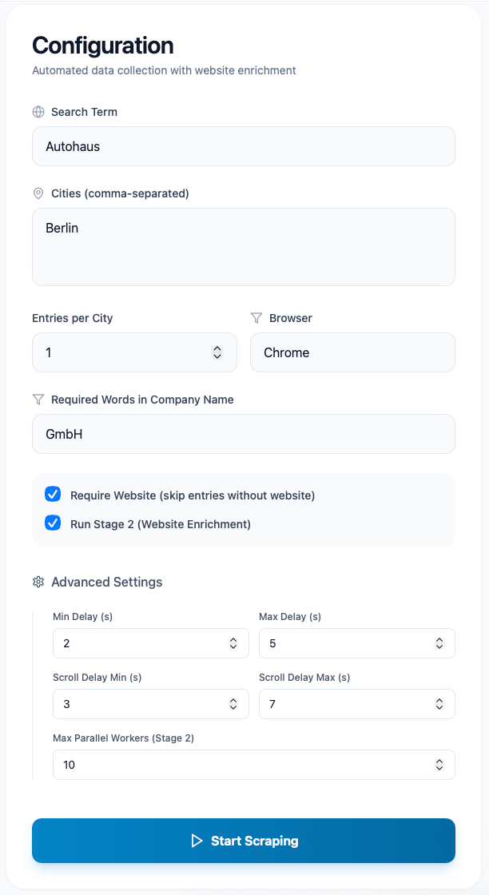
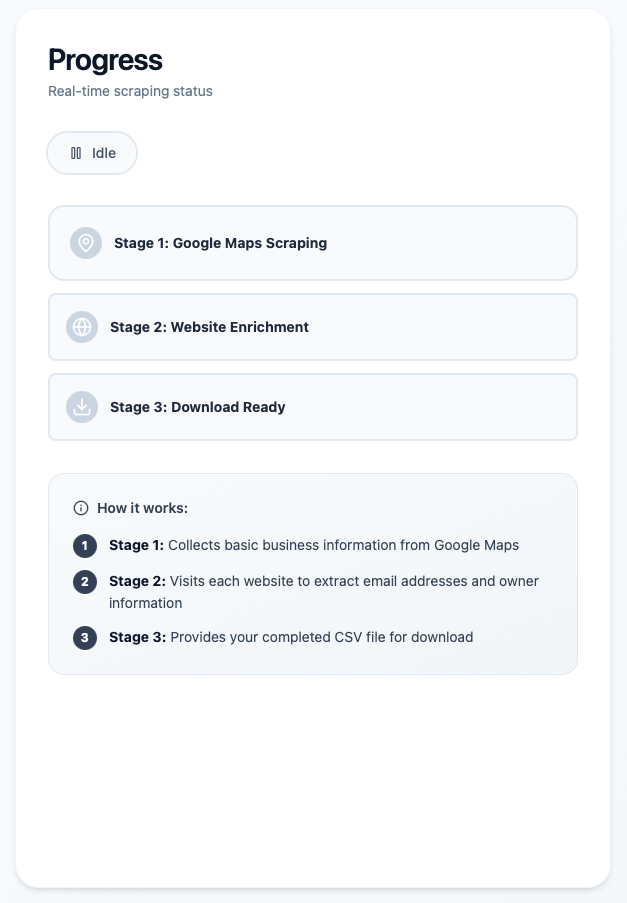

# 🗺️ MapMiner

A stunning, Apple-inspired web application for mining business data from Google Maps with intelligent website enrichment to extract contact information.



## ✨ Features

### 🎯 Smart Data Collection
- **Stage 1: Google Maps Mining** - Extract business information (name, address, phone, website, rating, reviews)
- **Stage 2: Website Enrichment** - Automatically visit websites to find email addresses and owner information
- **Intelligent Filtering** - Filter by required words (e.g., "GmbH", "Co. KG", "AG") before processing
- **Website Requirement** - Option to only save entries with websites for Stage 2 processing

### 🚀 Performance Optimized
- **Early Filtering** - Checks company names in search results before clicking (massive speed boost)
- **Parallel Processing** - Configurable workers for Stage 2 (default: 10 concurrent threads)
- **Smart Delays** - Human-like behavior with randomized delays
- **Browser Selection** - Choose Safari, Chrome, or Edge

### 🎨 Beautiful UI
- **Apple-Inspired Design** - Clean, elegant interface with smooth animations
- **Real-Time Updates** - Live progress tracking via WebSocket
- **Activity Logs** - Color-coded logs for easy monitoring
- **Statistics Dashboard** - Track businesses scraped, emails found, and more
- **Responsive Design** - Works perfectly on all screen sizes

### 🌍 Multi-Language Support
- English and German translations
- Easy to extend with additional languages

## 📸 Screenshots

### Main Dashboard


### Configuration Panel


### Real-Time Progress


## 🚀 Quick Start

### Prerequisites
- **Python 3.8+**
- **Node.js 20.19+ or 22.12+**
- **Safari** (built-in on Mac) or **Chrome/Edge** browser

### Installation

1. **Clone the repository**
```bash
git clone <your-repo-url>
cd MapMiner
```

2. **Backend Setup**
```bash
cd backend
python3 -m venv venv
source venv/bin/activate  # On Mac/Linux
# OR
venv\Scripts\activate     # On Windows

pip install -r requirements.txt
```

3. **Frontend Setup**
```bash
cd frontend
npm install
```

### Running the Application

**Option 1: Use the start script (Mac/Linux)**
```bash
./start.sh
```

**Option 2: Manual start**

Terminal 1 - Backend:
```bash
cd backend
source venv/bin/activate
python app.py
```

Terminal 2 - Frontend:
```bash
cd frontend
npm run dev
```

Open your browser to `http://localhost:5173`

## 📖 Usage Guide

### Basic Configuration

1. **Search Term** - What you're looking for (e.g., "Autohaus", "Restaurant", "Hotel")
2. **Cities** - Comma-separated list (e.g., "Berlin, München, Hamburg")
3. **Entries per City** - How many matching results to collect per city
4. **Required Words** - Filter by company type (e.g., "GmbH, Co. KG, AG")
5. **Browser** - Choose Safari, Chrome, or Edge
6. **Require Website** - Only save entries with websites (recommended for Stage 2)
7. **Run Stage 2** - Enable/disable website enrichment

### Advanced Settings

- **Min/Max Delay** - Random delays between actions (2-5s default)
- **Scroll Delays** - Delays when scrolling results (3-7s default)
- **Max Workers** - Parallel threads for Stage 2 (10 default, max 50)

### How It Works

**Stage 1: Google Maps Mining**
- Searches Google Maps for your search term in each city
- Filters results by required words (if specified)
- Only clicks listings that match your criteria (speed optimization!)
- Extracts: name, address, phone, website, rating, reviews
- Saves to CSV in `backend/output/`

**Stage 2: Website Enrichment**
- Visits each website in parallel
- Extracts email addresses using smart patterns
- Finds owner/manager names (German patterns supported)
- Updates CSV with contact information

**Stage 3: Download**
- Download your completed CSV file with all data

## 📁 Output

CSV files are saved in `backend/output/` with the format:
```
{search_term}_{timestamp}.csv
```

Example: `Autohaus_20260203_104530.csv`

### CSV Columns
- `name` - Business name
- `address` - Full address
- `phone` - Phone number
- `website` - Website URL
- `rating` - Google Maps rating
- `reviews` - Number of reviews
- `email` - Email address(es) found
- `owner` - Owner/manager name found

## 🎨 Taking Screenshots for GitHub

To add screenshots to your README:

1. **Take screenshots**
   - Mac: Press `Cmd + Shift + 4`, then drag to select area
   - Windows: Press `Win + Shift + S`

2. **Create screenshots folder**
```bash
mkdir screenshots
```

3. **Save screenshots**
   - `screenshots/dashboard.png` - Main dashboard view
   - `screenshots/configuration.png` - Configuration panel
   - `screenshots/progress.png` - Progress tracking

4. **Reference in README**
```markdown

```

## 🏗️ Project Structure

```
MapMiner/
├── backend/
│   ├── output/              # CSV output files
│   ├── app.py              # Flask server + WebSocket
│   ├── scraper_orchestrator.py  # Workflow manager
│   └── requirements.txt    # Python dependencies
├── frontend/
│   ├── src/
│   │   ├── components/     # React components
│   │   ├── App.jsx        # Main app
│   │   └── translations.js # i18n
│   └── package.json       # Node dependencies
├── maps_scraper_configurable.py   # Stage 1: MapMiner
├── website_scraper_configurable.py # Stage 2: Enrichment
├── screenshots/           # UI screenshots
└── README.md             # This file
```

## ⚙️ Configuration

### Browser Setup

**Safari (Mac only)**
```bash
safaridriver --enable
```

**Chrome/Edge**
- Automatically managed by Selenium
- WebDriver downloads happen automatically

### Environment Variables

None required! Everything is configured through the UI.

## 🐛 Troubleshooting

### "Could not find search box"
- Google Maps structure may have changed
- Try a different browser
- Check your internet connection

### "Failed to download CSV"
- Ensure scraping completed successfully
- Check `backend/output/` directory exists
- Restart backend server

### "White screen in browser"
- Check browser console for errors (F12)
- Verify all dependencies installed: `npm install`
- Clear cache and hard reload (Cmd+Shift+R / Ctrl+Shift+R)

### Browser crashes
- Try a different browser (Safari → Chrome → Edge)
- Reduce entries per city
- Increase delays in advanced settings

## 🚀 Performance Tips

1. **Use Required Words filter** - Dramatically speeds up scraping by filtering before clicking
2. **Enable "Require Website"** - Skips entries without websites (faster Stage 1)
3. **Increase Max Workers** - More parallel processing in Stage 2 (20-30 for fast machines)
4. **Start small** - Test with 1-2 cities and low entry count first
5. **Monitor logs** - Watch for errors or rate limiting

## ⚠️ Legal & Ethical Use

- Respect Google Maps Terms of Service
- Respect robots.txt files
- Use reasonable delays to avoid overwhelming servers
- Use scraped data responsibly and ethically
- Consider privacy laws (GDPR, etc.) when handling contact information

## 🔄 Updates

### Updating Dependencies

Backend:
```bash
cd backend
source venv/bin/activate
pip install --upgrade -r requirements.txt
```

Frontend:
```bash
cd frontend
npm update
```

## 🎯 Roadmap

- [ ] Export to multiple formats (JSON, Excel)
- [ ] Scheduled scraping
- [ ] API endpoint for programmatic access
- [ ] More language support
- [ ] Advanced filtering options
- [ ] Duplicate detection

## 🤝 Contributing

Contributions are welcome! Please feel free to submit a Pull Request.

## 📄 License

This project is for educational purposes. Please ensure you comply with all applicable laws and terms of service when using this tool.

## 🙏 Acknowledgments

- Built with React, Flask, Selenium, and BeautifulSoup
- UI inspired by Apple's design principles
- Icons from Lucide React

---

**Made with ❤️ for efficient data collection**
